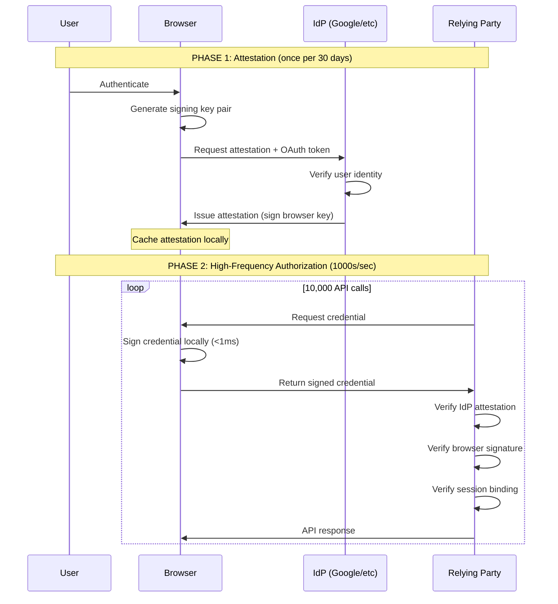
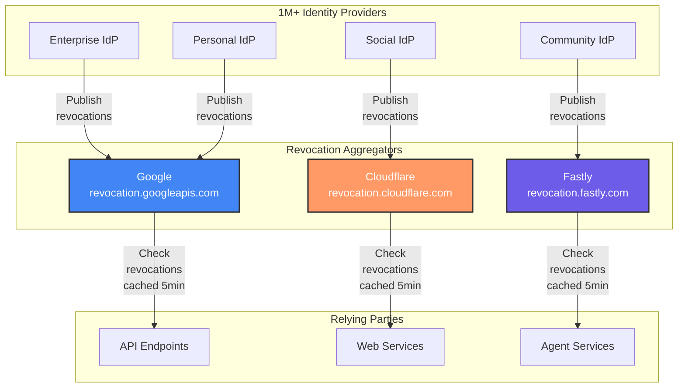

# Browser-as-IdP: Authorization at the Edge

A [Proposal](https://fedidcg.github.io/charter#proposals) of the [Federated Identity Community Group](https://fedidcg.github.io/) to enable browsers to act as Identity Providers—signing authorization credentials locally to address the performance, security, and capability challenges of high-frequency authenticated API access.

**Stage**: [Stage 1](https://github.com/w3c-fedid/Administration/blob/main/proposals-CG-WG.md#stage-1) <br />
**Champions**: @www <br />
**Participate**: https://github.com/w3c-fedid/broewser-as-idp/issues

---

## The Problem

### 1. Authorization Latency Doesn't Scale

**Current state**:
- AI/ML API calls: 96% YoY growth (2022-2023)
- Each call requires OAuth authorization
- Round-trip to IdP: 150-300ms

**Near-term challenge**:
- AI agents will make 100-1000x more calls than humans
- Authorization becomes primary bottleneck

**Example**:
```javascript
// Agent analyzing dataset: 10,000 API calls
for (let i = 0; i < 10000; i++) {
  const token = await oauth.getToken();  // 200ms IdP round-trip
  await api.call(token);
}
// Total overhead: 2,000 seconds (33 minutes) just for authorization
```

### 2. Bearer Token Security vs. Performance Dilemma

**OAuth tokens are portable by design** (enables SSO, cross-device, server-to-server). But this creates a security trade-off:

- **Short-lived tokens** (secure): Frequent IdP round-trips = poor performance
- **Long-lived tokens** (fast): Larger theft window = security risk

OAuth 2.0 Security Best Current Practice explicitly warns against long-lived tokens, but performance requirements push deployments toward them.

**The question partners ask**: "Why not just cache OAuth tokens?"

**The answer**:

| Requirement | Cached OAuth Tokens | Browser Credential Signing |
|-------------|---------------------|---------------------------|
| **Latency** | Good (cached) | Better (<1ms local signing) |
| **Theft resistance** | No - Bearer token stealable | Yes - Session-bound, device-locked |
| **Spending limits** | No - API-enforced (bypassable) | Yes - Crypto-enforced |
| **Offline capable** | No - Expires, needs refresh | Yes - Signs indefinitely |
| **Selective disclosure** | No - Static claims | Yes - Fresh proof per request |

**Key difference**: Browser's private key never leaves device, enabling session binding impossible with portable OAuth tokens.

### 3. Agent Payment Deadlock

**Emerging requirement**: AI agents need to autonomously pay for API services (compute, data, analysis).

**Current OAuth limitations**:
- Requires human consent per payment
- No cryptographic spending limits (all-or-nothing access)
- Agent compromise = full account access

---

## The Solution: Browser-as-IdP

### Architecture Overview

Browser-as-IdP transforms the traditional three-party federated identity model into a two-phase delegation model where browsers become signing authorities:



### Core Concept

**IdPs delegate credential signing authority to browsers** via attestations. Browsers then sign credentials locally without IdP round-trips.

```javascript
// PHASE 1: DELEGATION (infrequent - once per 30 days)
const delegation = await navigator.credentials.get({
  fedcm: {
    providers: [{
      configURL: "https://accounts.google.com/fedcm.json",
      requestDelegation: true  // Request signing authority
    }]
  }
});

// Google attests: "Browser key ABC can sign on behalf of user@gmail.com"
// Attestation cached locally (valid 30 days)

// PHASE 2: HIGH-FREQUENCY SIGNING (thousands per second)
for (let i = 0; i < 10000; i++) {
  const credential = await navigator.credentials.sign({
    delegation: delegation,      // Google's attestation
    audience: "https://api.example.com",
    nonce: await rp.getNonce(),
    binding: { tlsSession: currentSession }
  });

  await api.call(credential);    // <1ms overhead (not 200ms)
}
```

### Trust Model

**RPs verify in two steps**:

```javascript
async function verifyCredential(credential) {
  // 1. Verify IdP attestation: "Did Google vouch for this browser key?"
  const attestationValid = await verifyIdPAttestation(
    credential.delegation,
    "https://accounts.google.com"
  );

  // 2. Verify browser signature: "Did browser key sign this credential?"
  const signatureValid = await verifyBrowserSignature(
    credential,
    credential.delegation.browserPublicKey
  );

  // 3. Verify session binding: "Is this the correct TLS session?"
  const sessionValid = credential.binding.tlsSession === currentTLSSession;

  return attestationValid && signatureValid && sessionValid;
}
```

**IdPs maintain control**:
- Issue/revoke attestations
- Set attestation validity periods
- Monitor usage (privacy-preserving telemetry)
- Handle account recovery

**Browsers provide**:
- Local signing (<1ms)
- Session binding (theft prevention)
- Capability enforcement (spending limits)
- Selective disclosure (privacy)

---

## Use Cases

### 1. High-Frequency AI Agent API Access

**Problem**: Agent makes 10,000 API calls, each needing authorization.

**With OAuth**: 10,000 × 200ms = 2,000 seconds overhead

**With Browser Signing**: 10,000 × <1ms = <10 seconds overhead

**Result**: 200x faster

### 2. Agent Autonomous Payments (AP2)

**Problem**: Agent needs to pay for API services autonomously with spending limits.

```javascript
// User delegates payment authority to agent
const agentCred = await navigator.credentials.get({
  fedcm: {
    providers: [{ configURL: "https://accounts.google.com/fedcm.json" }],
    capabilities: {
      payment: {
        maxAmount: "100.00",     // $100 total
        perTransaction: "1.00"   // $1 per call
      }
    }
  }
});

// Agent autonomously pays for services
await agent.callAPI("https://api.example/analyze", {
  credential: agentCred,
  payment: { amount: "0.10" }
});

// Browser enforces limits cryptographically
// Agent CANNOT generate valid proof for amount > $1
```

**Result**: Enable agent economy with controlled risk.

### 3. Offline Authorization

**Problem**: Network outage prevents OAuth token refresh.

**With Browser Signing**: Browser signs locally (no network needed), transactions queued for settlement when reconnected.

**Result**: 100% uptime for authorization.

### 4. Privacy-Preserving Verification

**Problem**: Prove age > 21 without revealing birthdate.

```javascript
const proof = await credential.generateProof({
  reveal: [],  // Hide everything
  predicates: { age: { greaterThan: 21 } }
});
// RP gets cryptographic proof, not raw birthdate
```

**Result**: GDPR Article 25 compliance (data minimization by design).

---

## The Revocation Infrastructure Opportunity

### The Challenge at Scale

With millions of IdPs, traditional revocation doesn't scale:
- **CRLs**: 1M IdPs × 1KB = 1GB (too much data)
- **OCSP**: Real-time IdP queries (defeats performance benefit)

### The Solution: Aggregation Layer

**Major infrastructure providers operate revocation aggregators**:



**Architecture**: IdPs publish revocations to aggregators, RPs query aggregators (not individual IdPs)

### Why Operate an Aggregator?

**For infrastructure providers (Google, Cloudflare, etc.)**:

1. **Critical infrastructure position**: Every credential check flows through you
2. **Revenue opportunity**: $180M+/year market with agent economy growth
3. **Network effects**: More IdPs → More value → More RPs
4. **Platform leverage**: Bundle with existing services (GCP, Workers, CDN)
5. **Minimal cost**: Leverage existing CDN infrastructure

**Market potential**:
- Current: 10B checks/day × $0.000001 = $3.6M/year per aggregator
- With agents (100x growth): $360M/year per aggregator

### Implementation (4-6 Weeks)

```javascript
// Aggregator API (standardized)
// IdPs publish revocations
POST https://revocation.googleapis.com/v1/publish
{
  "idp": "https://community-idp.example",
  "browserKey": "abc123",
  "signature": "..."  // IdP signature
}

// RPs check revocations (cached 5 min)
GET https://revocation.googleapis.com/v1/check?idp=...&key=...
{
  "revoked": false,
  "checkedAt": 1234567890,
  "nextCheck": 1234568190
}
```

**Infrastructure costs**: $10-50K/month
**Revenue potential**: $150K-1M/month (with growth)
**ROI**: 3-20x

### Strategic Choice for Major IdPs

**Option A**: Stay IdP-only
- Compete with millions of new IdPs
- Lose market share
- Become commodity

**Option B**: Operate aggregator
- Become critical infrastructure
- Revenue from all credentials (not just yours)
- Platform position with network effects

**Recommendation**: Both (IdP + Aggregator) - hedge strategy

See [ADVANCED_SCENARIOS.md](./ADVANCED_SCENARIOS.md) for revocation architecture details.

---

## Technical Architecture

### POD (Provable Object Datatype) Format

Browser credentials use [POD format](https://pod.org) for:
- **Recursive proof composition**: Identity → Authorization → Payment → Audit
- **Selective disclosure**: Prove predicates without revealing claims
- **Cryptographic integrity**: Tamper-proof structure

```javascript
// Browser issues credential as POD
const credential = POD.create({
  issuer: "chrome://identity/user-abc",
  subject: "user@gmail.com",

  // IdP attestation (Google vouched for browser key)
  attestation: {
    idp: "https://accounts.google.com",
    browserKey: "...",
    validUntil: 1237159890,
    signature: "..."
  },

  // Session binding (prevents theft)
  binding: {
    tlsSessionId: "abc123...",
    deviceAttestation: "..."  // TPM/Secure Enclave
  },

  // Claims (selectively disclosable)
  claims: { email: "user@gmail.com", age: 34 }
});

// Generate proof with selective disclosure
const proof = credential.generateProof({
  reveal: ["email"],
  predicates: { age: { greaterThan: 21 } }
});
```

### Session Binding Mechanism

**Prevents credential theft**:
1. Browser includes TLS session ID in credential
2. Browser signs credential with session-specific key
3. RP verifies TLS session matches current connection
4. Stolen credential unusable (different TLS session)

See [TECHNICAL_SPEC.md](./TECHNICAL_SPEC.md) for protocol details.

### Agent Payment Protocol (AP2)

**For autonomous agent payments**:

```javascript
// 1. Browser issues identity POD
const identityPOD = await browserIdP.issue({ email, accountId });

// 2. Agent proves spending authority
const spendingProof = identityPOD.generateProof({
  prove: {
    authorizedSpender: true,
    budgetRemaining: { greaterThan: 100 }
  },
  reveal: []  // Hide account details
});

// 3. Service verifies + issues receipt POD
const receiptPOD = POD.create({
  parentProof: spendingProof,  // Cryptographic chain
  amount: 100,
  timestamp: Date.now()
});

// 4. Auditor verifies entire chain (privacy-preserving)
const valid = receiptPOD.verifyChain();
// Confirms: Authorized spender, sufficient budget, valid payment
// Without revealing: Account balance, email, transaction details
```

**What POD + recursive proofs solve**:
1. **Agent authorization chain**: Browser → Agent → Service → Receipt → Audit
2. **Privacy-preserving budgets**: Prove "under budget" without revealing spend history
3. **Delegated authority**: Prove "authorized by X" without revealing X's credential
4. **Compliance**: Audit trails without data retention liability

See [PAYMENT_INTEGRATION.md](./PAYMENT_INTEGRATION.md) for payment handler integration.

---

## Cost/Benefit Analysis

### For Identity Providers

**Costs**:
- Implement attestation endpoint (~2-4 weeks)
- Define attestation policy
- (Optional) Operate revocation aggregator (~4-6 weeks)

**Benefits**:
- Reduced authorization load (browsers sign, not you)
- Aggregator revenue ($180M+/year market potential)
- Enable agent economy (new business models)
- Better security story (session binding)
- Competitive advantage vs. IdPs without this capability

**ROI**: 5-15x over 3 years

### For Relying Parties

**Costs**:
- Implement credential verification (~1-2 weeks)
- Integrate revocation checking (~1 week)

**Benefits**:
- 200-300x latency reduction for high-frequency scenarios
- 95%+ fraud reduction (session binding + device attestation)
- Lower compliance costs (selective disclosure = less PII)
- Enable agent use cases (new revenue opportunities)

**ROI**: 10-20x in year 1

### For Infrastructure Providers (Aggregators)

**Costs**:
- Build aggregator API (~4-6 weeks)
- Infrastructure: $10-50K/month

**Benefits**:
- Direct revenue: $150K-1M/month
- Platform position: Critical infrastructure
- Network effects: More valuable as ecosystem grows
- Bundle opportunities: Sell with existing services

**ROI**: 3-20x

---

## Implementation Roadmap

### Phase 1: Specification & Prototype (6 months)
- Finalize FedCM extension for credential delegation
- POD credential format specification
- Session binding mechanism
- Chrome/Chromium prototype

### Phase 2: Aggregator Infrastructure (6 months)
- 2-3 infrastructure providers launch aggregators
- Standardize aggregator API
- IdP integration guides

### Phase 3: IdP & RP Pilots (6 months)
- Partner with 3-5 IdPs (mix of enterprise/consumer)
- Pilot with 10-15 RPs
- Measure latency improvements, security benefits

### Phase 4: Browser Rollout (12 months)
- Chrome stable release
- Firefox, Safari implementations
- Developer tooling and libraries

### Phase 5: Ecosystem Expansion (Ongoing)
- Agent platform integration
- Payment Handler API convergence
- Cross-browser credential portability

---

## Privacy & Security

### Privacy Benefits
- **Selective disclosure**: Share minimum necessary claims per request
- **Unlinkability**: Different RPs get uncorrelatable credentials
- **Local control**: Identity data stored on-device, user-controlled
- **Anonymous tokens**: Rate-limited access without identity disclosure

### Security Benefits
- **Session binding**: Stolen credentials unusable (TLS session mismatch)
- **Device attestation**: Prove legitimate hardware (TPM, Secure Enclave)
- **Cryptographic capabilities**: Spending limits mathematically enforced
- **Short-lived proofs**: Each proof valid seconds, single-use nonce

### Compliance
- **GDPR Article 25**: Data minimization by design
- **PSD2**: Strong customer authentication
- **OAuth 2.0 BCP**: Short-lived credentials (seconds, not hours)
- **COPPA**: Age verification without revealing birthdate

---

## Open Questions

### Technical
1. **Attestation validity**: What's optimal balance (30 days vs. 90 days)?
2. **Revocation SLA**: How fast must aggregators propagate revocations?
3. **Cross-browser portability**: Should credentials move between browsers?
4. **Device attestation**: TPM required, optional, or user choice?

### Governance
1. **Liability**: When browser-signed credential misused, who's responsible?
2. **Aggregator neutrality**: How to ensure fair treatment of all IdPs?
3. **Certification**: Should browsers be certified for security levels?

### Economic
1. **Aggregator pricing**: Per-query, subscription, or freemium?
2. **IdP attestation fees**: Can IdPs charge for attestations?
3. **Revenue sharing**: Between browsers, IdPs, aggregators?

---

## Next Steps

### For Browser Implementers
1. Review FedCM extension proposal
2. Prototype credential signing API
3. Implement session binding mechanism
4. Participate in standards discussion

### For Identity Providers
1. Evaluate attestation endpoint implementation
2. Consider aggregator operation opportunity
3. Join pilot program (email: [contact])
4. Provide feedback on trust model

### For Infrastructure Providers (Aggregators)
1. Assess aggregator business case
2. Prototype aggregator API
3. Join aggregator working group
4. Define pricing/SLA models

### For Relying Parties
1. Evaluate high-frequency use cases (agents, APIs)
2. Test credential verification with pilot IdPs
3. Measure latency improvements
4. Provide RP perspective on requirements

### Standardization
1. Gather feedback from FedID CG
2. Security and privacy review
3. Iterate on protocol design
4. Propose to W3C WebAuthn/Credentials WG

---

## Conclusion

Browser Credential Signing addresses a critical scalability challenge: the explosion of authenticated API calls driven by AI/ML services and, soon, autonomous agents.

**By moving authorization signing to the browser**:
- 200-300x latency reduction (sub-millisecond local signing)
- Stronger security (session binding, device attestation)
- New capabilities (agent payments, offline auth, selective disclosure)
- Infrastructure opportunity (revocation aggregators)

**The model preserves IdP control** while enabling performance and security improvements. IdPs delegate signing authority but remain the root of trust for identity.

**The aggregator opportunity** positions infrastructure providers as critical infrastructure for the emerging credential ecosystem—a larger market than traditional IdP services.

We invite the FedID community to collaborate on refining this proposal.

---

## Technical Specifications

- [TECHNICAL_SPEC.md](./TECHNICAL_SPEC.md) - Protocol details, POD format, session binding
- [PAYMENT_INTEGRATION.md](./PAYMENT_INTEGRATION.md) - Payment Handler API, AP2 agent payments
- [ADVANCED_SCENARIOS.md](./ADVANCED_SCENARIOS.md) - Revocation aggregation, P2P, extensions

---

**Related Standards**:
- [FedCM](https://fedidcg.github.io/FedCM/)
- [W3C Verifiable Credentials](https://www.w3.org/TR/vc-data-model/)
- [Payment Handler API](https://www.w3.org/TR/payment-handler/)
- [WebAuthn](https://www.w3.org/TR/webauthn/)
- [POD Specification](https://pod.org)
- [OAuth 2.0 Security BCP](https://datatracker.ietf.org/doc/html/draft-ietf-oauth-security-topics)
