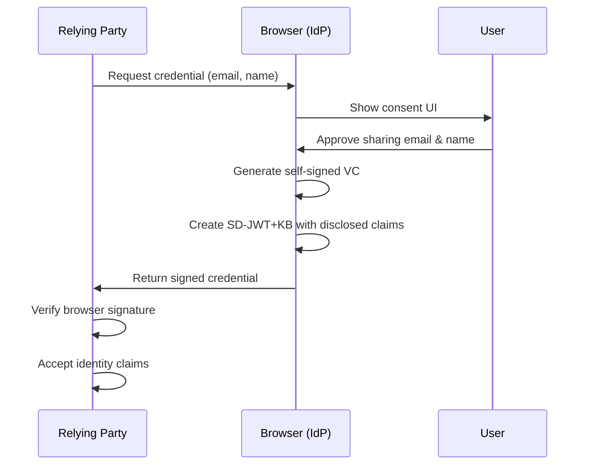

# Browser-as-IdP: Federated Credential Management

This is a [Proposal](https://fedidcg.github.io/charter#proposals) of the [Federated Identity Community Group](https://fedidcg.github.io/) to enable browsers to act as first-class Identity Providers in peer-to-peer federated authentication.

# Stage

This is a [Stage 1](https://github.com/w3c-fedid/Administration/blob/main/proposals-CG-WG.md#stage-1) proposal.

# Champions

* @samuelgoto

# Participate
- https://github.com/w3c-fedid/delegation/issues

# Background and Motivation

## The Evolution Beyond Delegation

The original [FedCM](https://fedidcg.github.io/FedCM/) API and subsequent [delegation-oriented approaches](https://github.com/w3c-fedid/FedCM/blob/main/explorations/proposal.md#the-delegation-oriented-api) addressed critical privacy problems in federated identity:

1. **The Classification Problem**: Browsers couldn't distinguish between tracking and legitimate federation
2. **The RP Tracking Problem**: Identity providers released global identifiers (like email addresses)
3. **The IdP Tracking Problem**: Identity providers could track which websites users logged into

While delegation-oriented FedCM solved the IdP Tracking Problem by having the browser act as a "holder" that mediates between issuers and verifiers, it still required external identity providers to issue credentials. This proposal takes a fundamentally different approach: **the browser itself becomes the Identity Provider**.

## Why Make the Browser the IdP?

### The Peer-to-Peer Web

The web platform has evolved powerful new capabilities that enable browsers to operate as full-fledged identity providers:

- **[Isolated Web Apps](https://github.com/WICG/isolated-web-apps)**: Provide strong origin isolation and cryptographic integrity
- **[Direct Sockets](https://github.com/WICG/direct-sockets)**: Enable peer-to-peer networking without intermediary servers
- **[WebMCP](https://github.com/modelcontextprotocol/mcp)**: Allows secure in-page protocol execution
- **Browser Extensions**: Can act as trusted IdP contexts with `chrome-extension://{id}` origins

These technologies enable a **peer-to-peer federated identity model** where users control their identity directly through their browser, without requiring corporate identity providers.

### Key Advantages

1. **True User Sovereignty**: Users own and control their identity data locally in their browser
2. **No Third-Party Tracking**: Neither RPs nor external IdPs can track users across sites
3. **Offline-First Identity**: Users can authenticate without network connectivity to external IdPs
4. **Reduced Infrastructure Costs**: No need to operate IdP infrastructure
5. **Greater Privacy**: Identity data never leaves the user's device unless explicitly disclosed
6. **Decentralization**: Breaks dependence on centralized identity providers
7. **Interoperability**: Browser-issued credentials work across any site using the standard API

## Use Cases

### 1. Extension-Based Identity Providers

Browser extensions running in isolated contexts (`chrome-extension://{id}`) can act as IdPs:

```javascript
// Extension background service worker acts as IdP
chrome.identity.registerAsProvider({
  name: "My Personal IdP",
  accounts: [{
    id: "user123",
    email: "user@example.com",
    name: "Alice Smith",
    picture: "chrome-extension://abc123/profile.png"
  }]
});
```

### 2. Isolated Web App Identity Providers

Installed web apps with cryptographic integrity can provide identity services:

```javascript
// Isolated Web App acting as IdP
navigator.identity.provider.register({
  origin: "isolated-app://myidp",
  name: "Personal Identity Wallet",
  capabilities: ["vc+sd-jwt", "mdoc"]
});
```

### 3. In-Page Peer-to-Peer Authentication

Using Direct Sockets, pages can establish direct peer-to-peer authentication:

```javascript
// Establish P2P connection for identity exchange
const socket = new TCPSocket("peer.example.com", 8443);
const credential = await navigator.credentials.get({
  identity: {
    mode: "p2p",
    transport: socket,
    fields: ["email", "name"]
  }
});
```

### 4. WebMCP Protocol-Based Identity

Identity protocols can run directly in the browser context:

```javascript
// Use WebMCP to execute identity protocol in-page
const mcp = await navigator.mcp.connect({
  protocol: "openid-connect",
  mode: "browser-idp"
});

const token = await mcp.authenticate({
  claims: ["email", "name"],
  audience: "https://rp.example"
});
```

# Proposal

## Architecture Overview

In the **Browser-as-IdP model**, we collapse the three-party model (Issuer-Holder-Verifier) into a **two-party peer-to-peer model**:

- **Verifier** (Relying Party): The website requesting authentication
- **Browser IdP** (User Agent): The browser itself, acting as the identity provider



### Key Difference from Delegation Model

| Aspect | Delegation Model | Browser-as-IdP Model |
|--------|------------------|----------------------|
| **Parties** | 3 (Issuer, Holder, Verifier) | 2 (Browser IdP, Verifier) |
| **Credential Source** | External IdP | Browser itself |
| **Trust Root** | IdP's signing key | Browser's signing key |
| **Network Dependency** | Requires IdP connection | Fully offline capable |
| **Privacy** | IdP blind to RP | No IdP exists to track |
| **User Control** | Browser mediates | Browser owns identity |

## Browser Identity Provider API

### 1. Browser Identity Registration

Browsers expose identity provider capabilities:

```javascript
// Browser exposes its IdP capabilities
if (navigator.identity.provider) {
  console.log("This browser can act as an IdP");

  // Register user identity locally
  await navigator.identity.provider.register({
    accounts: [{
      id: crypto.randomUUID(),
      email: "user@example.com",
      name: "Alice Smith",
      picture: "/profile.jpg",
      // Claims are stored locally, encrypted at rest
    }]
  });
}
```

### 2. Relying Party Request

Websites request credentials from the browser IdP:

```javascript
const credential = await navigator.credentials.get({
  identity: {
    mode: "browser-idp",
    context: {
      // Accept credentials from browser itself
      idpType: "browser",
      // Or from browser extensions
      idpType: "extension",
      // Or from isolated web apps
      idpType: "isolated-app"
    },
    format: "vc+sd-jwt",
    fields: ["email", "name"],
    nonce: crypto.randomUUID()
  }
});

// credential.token contains browser-signed SD-JWT+KB
```

### 3. Browser-Issued Credentials

The browser generates self-signed verifiable credentials:

```javascript
// Browser generates credential (internal process)
{
  // JWT Header
  "typ": "vc+sd-jwt",
  "alg": "ES256",
  // Browser's public key location
  "jku": "chrome://identity/keys.json"
}

// JWT Payload
{
  "iss": "chrome://identity",  // Browser is the issuer
  "sub": "user-123",
  "iat": 1234567890,
  "exp": 1234567900,

  // Selective disclosure hashes
  "_sd": [
    "hash_of_email",
    "hash_of_name"
  ],
  "_sd_alg": "SHA-256",

  // Key binding for replay protection
  "cnf": {
    "jwk": { /* ephemeral public key */ }
  }
}
```

## Peer-to-Peer Federated Identity

### Direct Socket Integration

For true peer-to-peer scenarios, browsers can exchange credentials directly:

```javascript
// Peer 1: Establish identity server
const server = new TCPServerSocket("0.0.0.0", 8443);
server.onconnect = async (socket) => {
  const request = await socket.read();

  // Generate credential for peer
  const credential = await navigator.identity.provider.issue({
    fields: JSON.parse(request).claims,
    audience: socket.remoteAddress
  });

  await socket.write(JSON.stringify(credential));
};

// Peer 2: Request credential from peer
const socket = new TCPSocket("peer1.local", 8443);
await socket.write(JSON.stringify({
  claims: ["email", "name"]
}));

const credential = JSON.parse(await socket.read());
```

### WebMCP Identity Protocol

Identity protocols can run in-browser using WebMCP:

```javascript
// MCP server runs in browser, handles identity requests
const mcpServer = navigator.mcp.createServer({
  name: "browser-identity-provider",
  version: "1.0.0"
});

mcpServer.onRequest("authenticate", async (params) => {
  const credential = await navigator.identity.provider.issue({
    fields: params.claims,
    audience: params.audience,
    format: params.format || "vc+sd-jwt"
  });

  return { credential };
});

// Client uses MCP to request identity
const client = await navigator.mcp.connect("browser-identity-provider");
const result = await client.request("authenticate", {
  claims: ["email"],
  audience: "https://rp.example"
});
```

## Extension and Isolated App Support

### Chrome Extension as IdP

Extensions can register as identity providers using the `chrome-extension://{id}` scheme:

```javascript
// manifest.json
{
  "manifest_version": 3,
  "name": "Personal Identity Provider",
  "permissions": ["identity.provider"],
  "background": {
    "service_worker": "background.js"
  }
}

// background.js
chrome.identity.provider.register({
  name: "My Personal IdP",
  configURL: "chrome-extension://abc123def456/config.json",
  accounts_endpoint: "chrome-extension://abc123def456/accounts",
  vc_issuance_endpoint: "chrome-extension://abc123def456/issue",
  formats: ["vc+sd-jwt", "mdoc"]
});

// Handle credential issuance
chrome.identity.provider.onIssueRequest.addListener(async (request) => {
  // request.account_id
  // request.fields
  // request.format

  const credential = await generateCredential(request);
  return credential;
});
```

### Isolated Web App IdP

Installed web apps with cryptographic integrity can act as IdPs:

```javascript
// In an Isolated Web App
if (navigator.identity.provider) {
  await navigator.identity.provider.register({
    origin: self.origin, // isolated-app://...
    name: "Decentralized Identity Wallet",

    // IWA provides credential storage
    storage: "isolated",

    // Supports multiple formats
    formats: ["vc+sd-jwt", "mdoc", "bbs"],

    // IWA can use Direct Sockets for P2P
    transports: ["https", "p2p"]
  });
}
```

## Enabling for Testing

### Chrome Extension Scheme Support

To enable testing with browser extensions as IdPs:

```javascript
// Chrome flag to enable (for testing)
// chrome://flags/#enable-extension-idp

// Or via command line
// --enable-features=FedCmExtensionIdP

// In FedCM config, allow extension origins
const credential = await navigator.credentials.get({
  identity: {
    providers: [{
      configURL: "chrome-extension://abc123def456/fedcm.json",
      clientId: "relying-party-123",
      nonce: "xyz789"
    }]
  }
});
```

### Configuration for Extension IdP

```json
// chrome-extension://abc123def456/fedcm.json
{
  "accounts_endpoint": "chrome-extension://abc123def456/accounts",
  "client_metadata_endpoint": "chrome-extension://abc123def456/metadata",
  "id_assertion_endpoint": "chrome-extension://abc123def456/assert",
  "vc_issuance_endpoint": "chrome-extension://abc123def456/issue",

  "formats": ["vc+sd-jwt"],

  "branding": {
    "background_color": "#1a73e8",
    "color": "#ffffff",
    "name": "Personal IdP"
  }
}
```

## Trust Model

### Browser Signing Keys

Each browser instance maintains cryptographic signing keys:

```javascript
// Browser-managed keypair (internal)
{
  "private_key": "stored in OS keychain",
  "public_key": {
    "kty": "EC",
    "crv": "P-256",
    "x": "...",
    "y": "..."
  },
  "key_id": "chrome://identity/keys/1"
}
```

### Trust Establishment

RPs can trust browser-issued credentials through several mechanisms:

1. **Browser Vendor Signatures**: Major browsers sign their IdP public keys
2. **Device Attestation**: Leverage platform attestation (TPM, Secure Enclave)
3. **User Verification**: Biometric or PIN verification proves user presence
4. **Reputation Systems**: Distributed trust networks validate browser identities

```javascript
// RP verifies browser credential
async function verifyBrowserCredential(credential) {
  const {jwt, disclosures, kb} = parseSdJwtKb(credential.token);

  // 1. Verify issuer is a known browser
  if (jwt.iss.startsWith("chrome://") ||
      jwt.iss.startsWith("isolated-app://") ||
      jwt.iss.startsWith("chrome-extension://")) {

    // 2. Verify browser vendor signature on public key
    const browserKey = await fetch(jwt.jku);
    const isValidBrowser = await verifyBrowserVendorSignature(browserKey);

    // 3. Verify JWT signature
    const isValidJwt = await verifyJwtSignature(jwt, browserKey);

    // 4. Verify key binding
    const isValidKb = await verifyKeyBinding(kb, jwt.cnf.jwk);

    // 5. Check audience and nonce
    const isForUs = kb.aud === window.location.origin;
    const isRecent = validateNonce(kb.nonce);

    return isValidBrowser && isValidJwt && isValidKb && isForUs && isRecent;
  }

  throw new Error("Unknown issuer");
}
```

## Implementation Examples

### Example 1: Simple Browser IdP Login

```javascript
// Website requests authentication
const button = document.getElementById('login');
button.onclick = async () => {
  try {
    const credential = await navigator.credentials.get({
      identity: {
        mode: "browser-idp",
        format: "vc+sd-jwt",
        fields: ["email", "name"],
        nonce: await generateNonce()
      }
    });

    // Send to backend for verification
    const response = await fetch('/auth/login', {
      method: 'POST',
      headers: { 'Content-Type': 'application/json' },
      body: JSON.stringify({ token: credential.token })
    });

    const session = await response.json();
    console.log('Logged in:', session.user);

  } catch (error) {
    console.error('Authentication failed:', error);
  }
};
```

### Example 2: Extension-Based IdP

```javascript
// Extension provides identity for multiple personas
chrome.identity.provider.register({
  accounts: [
    {
      id: "personal",
      email: "alice@personal.com",
      name: "Alice Smith",
      type: "personal"
    },
    {
      id: "work",
      email: "alice@company.com",
      name: "Alice Smith",
      type: "work"
    }
  ]
});

// User can choose which identity to use per site
chrome.identity.provider.onAccountSelect.addListener((site, accounts) => {
  // Show UI to select persona
  return showPersonaSelector(site, accounts);
});
```

### Example 3: P2P Authentication with Direct Sockets

```javascript
// Device A: Run identity server
async function startIdentityServer() {
  const server = new TCPServerSocket({ port: 8443 });

  for await (const connection of server.connections) {
    const request = await connection.readable.getReader().read();

    // Generate credential for requesting peer
    const credential = await navigator.identity.provider.issue({
      fields: ["email", "publicKey"],
      audience: connection.remoteAddress,
      format: "vc+sd-jwt"
    });

    const writer = connection.writable.getWriter();
    await writer.write(new TextEncoder().encode(
      JSON.stringify(credential)
    ));
  }
}

// Device B: Request credential from peer
async function authenticateWithPeer(peerAddress) {
  const socket = new TCPSocket(peerAddress, 8443);

  const writer = socket.writable.getWriter();
  await writer.write(new TextEncoder().encode(JSON.stringify({
    type: "credential_request",
    claims: ["email", "publicKey"]
  })));

  const reader = socket.readable.getReader();
  const response = await reader.read();
  const credential = JSON.parse(
    new TextDecoder().decode(response.value)
  );

  // Verify and use credential
  return credential;
}
```

## Security Considerations

### Key Management

- **Browser Keys**: Stored in OS-level secure storage (Keychain, Credential Manager, etc.)
- **Extension Keys**: Isolated storage with extension permissions
- **IWA Keys**: Cryptographically bound to app identity
- **Rotation**: Periodic key rotation with backward compatibility

### Privacy Protections

1. **No Central Tracking**: No IdP exists to track user logins across sites
2. **Selective Disclosure**: Users control exactly what claims are shared
3. **Ephemeral Keys**: KB keys are single-use and discarded after authentication
4. **Local Storage**: Identity data never leaves the device unless user consents
5. **Origin Isolation**: Each RP receives isolated credentials

### Attack Mitigation

- **Phishing**: Browser UI clearly indicates local IdP vs. external
- **Replay Attacks**: Nonce + KB binding prevents credential reuse
- **Man-in-the-Middle**: TLS + key binding provides end-to-end integrity
- **Cross-Site Tracking**: No correlation possible without user consent

## Why This Is Better

### Compared to Traditional IdPs

| Aspect | Traditional IdP | Browser-as-IdP |
|--------|----------------|----------------|
| **Privacy** | IdP tracks all logins | Zero tracking |
| **Availability** | Requires IdP uptime | Always available |
| **Cost** | Infrastructure expenses | No infrastructure |
| **Control** | IdP controls identity | User controls identity |
| **Dependency** | Vendor lock-in | Decentralized |

### Compared to Delegation Model

| Aspect | Delegation Model | Browser-as-IdP |
|--------|------------------|----------------|
| **Complexity** | 3-party flow | 2-party flow |
| **Network** | Requires IdP connection | Offline-capable |
| **Trust** | Must trust external IdP | Trust local browser |
| **Bootstrapping** | Needs IdP ecosystem | Works immediately |
| **P2P Support** | Limited | Native |

## Integration with Emerging Technologies

### Direct Sockets API

Enable direct peer-to-peer identity exchange:

```javascript
// Peer authentication without servers
const peerCredential = await navigator.credentials.get({
  identity: {
    mode: "p2p",
    transport: new TCPSocket(peerAddress, 8443),
    fields: ["publicKey", "name"]
  }
});
```

### Isolated Web Apps

Installed apps with strong security guarantees:

```javascript
// IWA acts as installed identity provider
if (navigator.identity.provider.capabilities.isolated) {
  // Can store credentials securely
  // Has cryptographic identity
  // Can use Direct Sockets for P2P
}
```

### WebMCP

Run identity protocols in-browser:

```javascript
// MCP-based identity protocol execution
const idProtocol = await navigator.mcp.connect({
  protocol: "openid4vp",
  mode: "browser-idp"
});

const presentation = await idProtocol.request("presentCredential", {
  format: "vc+sd-jwt",
  fields: ["email"]
});
```

### Browser Extensions

Extensions as portable identity providers:

```javascript
// Extension syncs identity across devices
chrome.storage.sync.set({
  identities: encryptedIdentityData
});

// Extension provides IdP on any browser with extension installed
chrome.identity.provider.register({
  configURL: `chrome-extension://${chrome.runtime.id}/config.json`
});
```

## Advanced Cryptographic Primitives

The Browser-as-IdP model enables powerful privacy-preserving primitives beyond basic identity assertion. These advanced features allow browsers to issue credentials that prove properties without revealing identity.

### Anonymous Rate-Limited Tokens

Rate-limited tokens enable browsers to prove "I'm a unique legitimate user" without revealing identity, preventing abuse while preserving privacy.

#### Use Cases

- **Anti-spam**: Prove you're not a bot without revealing who you are
- **Rate limiting**: Enforce quotas per user without tracking identity
- **Fair resource allocation**: Prevent hoarding while maintaining anonymity
- **Voting systems**: One vote per person, fully anonymous
- **Anonymous ticketing**: Prove you have a valid ticket without showing ID

#### Implementation

```javascript
// Browser issues anonymous rate-limited token
const rateLimitedToken = await navigator.identity.provider.issueAnonymousToken({
  type: "rate-limited",
  scope: "https://api.example.com/submit",
  limit: {
    count: 10,           // 10 requests
    window: 86400000,    // per day
    strategy: "sliding"  // sliding window
  },
  // Zero-knowledge proof of uniqueness without revealing identity
  zkProof: {
    type: "groth16",
    circuit: "unique-user",
    publicInputs: ["scope", "timestamp"]
  }
});

// RP requests anonymous token for rate limiting
const credential = await navigator.credentials.get({
  identity: {
    mode: "browser-idp",
    tokenType: "anonymous-rate-limited",
    scope: "https://api.example.com/submit",
    rateLimits: {
      maxRequests: 10,
      window: "24h"
    }
  }
});

// Submit request with anonymous token
await fetch("https://api.example.com/submit", {
  method: "POST",
  headers: {
    "Authorization": `AnonymousToken ${credential.token}`
  },
  body: formData
});
```

#### Token Structure

```javascript
{
  // Anonymous token (no identity revealed)
  "typ": "anonymous+rate-limited",
  "alg": "BLS12-381",  // Pairing-friendly curve for efficient ZKPs

  // Token claims
  "scope": "https://api.example.com/submit",
  "iat": 1234567890,
  "exp": 1234654290,

  // Nullifier - prevents double-spending without revealing identity
  "nullifier": "H(secret, scope, epoch)",

  // Rate limit commitment
  "rate_commitment": "commit(user_id, scope, window)",

  // Zero-knowledge proof
  "zkp": {
    "proof": "...",  // Proves: I'm unique, haven't exceeded limit
    "public_inputs": ["scope", "nullifier", "timestamp"]
  }
}
```

#### Privacy Properties

1. **Anonymity**: Token reveals no identity information
2. **Unlinkability**: Different tokens cannot be linked to same user
3. **Rate Enforcement**: Impossible to exceed limits without detection
4. **Non-transferability**: Tokens bound to browser, can't be shared
5. **Revocability**: Misbehaving users can be revoked without identity exposure

### Session-Bound Credentials

Session-bound credentials cryptographically bind credentials to a specific TLS session, preventing credential theft and ensuring credentials can't be used outside their intended context.

#### Benefits Beyond Key Binding

Current KB (key binding) approach uses ephemeral keys discarded after use. Session-bound credentials go further by:

- Binding to TLS session via Channel ID / Token Binding
- Ensuring credentials only work within the originating session
- Preventing exfiltration attacks
- Enabling long-lived sessions without credential reuse risk

#### Implementation

```javascript
// Request session-bound credential
const credential = await navigator.credentials.get({
  identity: {
    mode: "browser-idp",
    format: "vc+sd-jwt",
    fields: ["email"],

    // Bind to current TLS session
    sessionBinding: {
      type: "tls-channel-id",
      includeSessionId: true,
      includeServerCert: true
    }
  }
});

// Credential is cryptographically bound to TLS session
const sessionBoundToken = credential.token;
// Format: <SD-JWT>~<disclosures>~<KB-JWT>~<session-binding>
```

#### Session Binding JWT

```javascript
// Session binding JWT (new component)
{
  // Header
  "typ": "session-binding+jwt",
  "alg": "ES256",

  // Payload
  "session_id": "tls_session_id_hash",
  "server_cert_hash": "H(server_cert)",
  "client_random": "...",
  "server_random": "...",

  // Binds credential to this specific TLS connection
  "channel_id": "H(client_random || server_random || ...)",

  // Optional: bind to specific IP/device fingerprint
  "device_binding": {
    "ip_commitment": "commit(ip_address, salt)",
    "ua_fingerprint_hash": "H(user_agent_fingerprint)"
  }
}

// Signature proves credential was issued within this TLS session
```

#### Attack Prevention

```javascript
// Scenario: Attacker steals session-bound credential

// 1. Attacker tries to use credential in different TLS session
async function attackerAttempt() {
  // Even if attacker has the credential token...
  const stolenToken = "...";

  // Server verifies session binding
  const isValid = await verifySessionBinding(stolenToken, currentTlsSession);
  // Returns false - session_id doesn't match
  // Credential is USELESS outside original session
}

// 2. Defender benefit: credential exfiltration is harmless
// - Malware steals credential from memory
// - Credential only works in victim's browser's TLS session
// - Attacker cannot use it, even immediately
// - No need to revoke/rotate credential
```

#### Use Cases

- **High-value transactions**: Bind payment authorization to session
- **Sensitive data access**: Healthcare records only accessible in original session
- **Multi-step workflows**: Ensure all steps happen in same session
- **Credential theft prevention**: Stolen credentials are useless
- **Session fixation prevention**: Sessions cannot be hijacked with valid credentials

### General Purpose Circuits (GPC)

GPCs enable browsers to prove arbitrary statements about user data using zero-knowledge proofs, without revealing the underlying data.

#### What are GPCs?

General Purpose Circuits are programmable zero-knowledge proof systems that can prove any computable statement. Unlike specialized ZK protocols, GPCs allow:

- Arbitrary logic in proof statements
- Composable proofs
- Privacy-preserving computations on credential data
- Verifiable computation without revealing inputs

#### Integration with Browser-as-IdP

```javascript
// Browser supports GPC-based credential proofs
const credential = await navigator.credentials.get({
  identity: {
    mode: "browser-idp",
    format: "vc+gpc",  // GPC-based credential

    // Define proof circuit
    circuit: {
      type: "circom",  // or "noir", "halo2", etc.
      source: "https://example.com/circuits/age-verification.circom",
      // Or inline circuit definition
      program: `
        template AgeVerification() {
          signal input birthdate;
          signal input currentDate;
          signal input minimumAge;
          signal output isOldEnough;

          component ageCalc = CalculateAge();
          ageCalc.birthdate <== birthdate;
          ageCalc.currentDate <== currentDate;

          isOldEnough <== ageCalc.age >= minimumAge;
        }
      `
    },

    // Public inputs (revealed to verifier)
    publicInputs: {
      minimumAge: 21,
      currentDate: "2025-11-04"
    },

    // Private inputs (kept secret, browser provides from user data)
    privateInputs: {
      birthdate: "private"  // Browser fills from user profile
    }
  }
});

// Verifier receives proof without learning actual birthdate
console.log(credential.proof);
// { isOldEnough: true, zkProof: "..." }
// Verifier knows user is ≥21, NOT their actual age/birthdate
```

#### Advanced GPC Use Cases

##### 1. Selective Disclosure with Complex Predicates

```javascript
// Prove: "I live in Europe AND I'm over 18 AND I'm a verified user"
const complexProof = await navigator.identity.provider.generateProof({
  circuit: "multi-predicate-verification",

  publicInputs: {
    requiredRegion: "EU",
    minimumAge: 18,
    requiredVerificationLevel: "government-id"
  },

  privateInputs: {
    country: "user_country",        // Private
    birthdate: "user_birthdate",    // Private
    verificationType: "user_verification" // Private
  },

  // Proof output is just boolean, no data leaked
  output: "satisfies_all_predicates"
});
```

##### 2. Reputation Proofs

```javascript
// Prove: "My reputation score is above threshold" without revealing exact score
const reputationProof = await navigator.credentials.get({
  identity: {
    mode: "browser-idp",
    format: "vc+gpc",
    circuit: "reputation-threshold",

    publicInputs: {
      threshold: 750,
      category: "marketplace-seller"
    },

    privateInputs: {
      actualScore: "user_reputation_score",
      reviewCount: "user_review_count",
      accountAge: "account_creation_date"
    },

    // Prove: score > threshold AND reviewCount > 10 AND accountAge > 6 months
    predicate: "score_above_threshold_with_history"
  }
});
```

##### 3. Financial Qualification Proofs

```javascript
// Prove: "My income qualifies me for this service" without revealing income
const incomeProof = await navigator.identity.provider.generateProof({
  circuit: "income-qualification",

  publicInputs: {
    minimumIncome: 50000,
    maximumIncome: 150000,  // Prove income is in range
    currency: "USD"
  },

  privateInputs: {
    actualIncome: "verified_income",
    taxDocuments: "w2_hash",
    employmentStatus: "employment_verification"
  },

  // Output: boolean, plus optional range proof
  output: {
    qualifies: true,
    // Optional: prove income is in bucket without exact value
    incomeBracket: "50k-100k"  // Coarse-grained disclosure
  }
});
```

##### 4. Social Graph Proofs

```javascript
// Prove: "I'm connected to someone you trust" without revealing who
const socialProof = await navigator.credentials.get({
  identity: {
    mode: "browser-idp",
    format: "vc+gpc",
    circuit: "transitive-trust",

    publicInputs: {
      trustAnchor: "verifier_public_key",
      maximumDistance: 3  // Within 3 hops
    },

    privateInputs: {
      socialGraph: "user_social_graph",
      connectionPath: "path_to_trust_anchor"
    },

    // Prove path exists without revealing path
    output: "is_trusted_within_distance"
  }
});
```

#### Circuit Formats Supported

```javascript
// Browser supports multiple ZK circuit frameworks
navigator.identity.provider.supportedCircuits = [
  "circom",      // Circom (widely used, mature)
  "noir",        // Noir (developer-friendly, Rust-like)
  "halo2",       // Halo2 (no trusted setup, efficient)
  "plonky2",     // Plonky2 (very fast proofs)
  "risc0",       // RISC Zero (general computation)
  "leo"          // Leo (Aleo's language)
];

// Extension can bundle circuits
chrome.identity.provider.registerCircuit({
  name: "age-verification-v1",
  type: "circom",
  wasmFile: "chrome-extension://abc123/circuits/age-verify.wasm",
  zkeyFile: "chrome-extension://abc123/circuits/age-verify.zkey",
  verificationKey: { /* ... */ }
});
```

### Provable Object Datatype (POD)

PODs are cryptographically signed data structures that enable provable statements about structured objects. Based on work from Zupass/0xPARC, PODs allow browsers to issue credentials with rich structure and provable properties.

#### What are PODs?

Provable Object Datatypes are signed JSON-like objects where:
- Each field is individually signed
- Selective disclosure of fields
- Provable computations on fields
- Composable with other PODs
- Supports complex nested structures

#### POD Structure

```javascript
// Browser issues POD-based credential
const podCredential = {
  // POD metadata
  type: "POD",
  version: "1.0",
  issuer: "chrome://identity",

  // Entries (name -> signed value)
  entries: {
    "email": {
      type: "string",
      value: "alice@example.com",
      signature: "sig_1"
    },
    "age": {
      type: "int",
      value: 28,
      signature: "sig_2"
    },
    "memberSince": {
      type: "date",
      value: "2020-01-15",
      signature: "sig_3"
    },
    "verificationLevel": {
      type: "string",
      value: "government-id",
      signature: "sig_4"
    },
    "reputation": {
      type: "object",
      value: {
        "score": 892,
        "reviewCount": 47,
        "categories": ["seller", "buyer"]
      },
      signature: "sig_5"
    }
  },

  // Merkle root of all entries for efficient verification
  contentRoot: "merkle_root_hash",

  // Issuer signature over contentRoot
  signature: "issuer_sig"
};
```

#### Browser POD API

```javascript
// Request POD credential from browser
const pod = await navigator.credentials.get({
  identity: {
    mode: "browser-idp",
    format: "pod",

    // Request specific fields
    fields: {
      email: { required: true },
      age: { required: false },
      memberSince: { required: false },
      "reputation.score": { required: false }  // Nested field
    },

    // Optional: request proofs about fields
    proofs: [
      {
        type: "range",
        field: "age",
        condition: "gte",
        value: 21
      },
      {
        type: "membership",
        field: "reputation.categories",
        value: "verified-seller"
      }
    ]
  }
});

// Browser returns POD with selective disclosure
const disclosedPOD = {
  type: "POD",
  issuer: "chrome://identity",

  // Only disclosed fields
  entries: {
    "email": {
      type: "string",
      value: "alice@example.com",
      signature: "sig_1",
      proof: "merkle_proof_1"  // Proves inclusion in contentRoot
    }
  },

  // Proofs without revealing values
  proofs: {
    "age_gte_21": {
      type: "range-proof",
      field: "age",
      condition: "gte",
      threshold: 21,
      satisfied: true,
      zkProof: "..."  // ZK proof that age >= 21
      // Actual age NOT revealed
    }
  },

  contentRoot: "merkle_root_hash",  // Same root, proves integrity
  signature: "issuer_sig"
};
```

#### POD Use Cases

##### 1. Event Tickets with Provable Properties

```javascript
// Browser stores event ticket as POD
const ticketPOD = await navigator.identity.provider.issuePOD({
  type: "event-ticket",
  entries: {
    "eventId": "concert-2025-11-04",
    "ticketClass": "VIP",
    "purchasePrice": 150.00,
    "purchaseDate": "2025-10-01",
    "ticketNumber": 12345,
    "ownerEmail": "alice@example.com"
  }
});

// At venue entrance: prove ownership without revealing all details
const entranceProof = await navigator.credentials.get({
  identity: {
    mode: "browser-idp",
    format: "pod",
    podType: "event-ticket",

    // Venue needs to verify
    disclose: ["eventId", "ticketClass"],

    // Prove ticket is valid without revealing price, ticket number, email
    prove: [
      { field: "ticketNumber", condition: "exists" },
      { field: "purchaseDate", condition: "before", value: "2025-11-04" }
    ]
  }
});
```

##### 2. Composable Credentials

```javascript
// Combine multiple PODs to prove complex statements
const employmentPOD = { /* POD proving employment */ };
const educationPOD = { /* POD proving degree */ };
const residencyPOD = { /* POD proving address */ };

// Create composite proof from multiple PODs
const visaApplication = await navigator.identity.provider.composePODs({
  pods: [employmentPOD, educationPOD, residencyPOD],

  // Prove complex statement across PODs
  statement: {
    // From employmentPOD
    employmentIncome: { gte: 75000 },
    employmentDuration: { gte: "2 years" },

    // From educationPOD
    degreeLevel: { in: ["bachelor", "master", "phd"] },

    // From residencyPOD
    residencyCountry: { equals: "US" },
    residencyDuration: { gte: "5 years" }
  },

  // Only reveal boolean result, not underlying data
  disclose: "statement_satisfied"
});
```

##### 3. Portable Reputation System

```javascript
// POD captures reputation across platforms
const reputationPOD = {
  type: "POD",
  entries: {
    "platform": "marketplace-x",
    "userId": "alice123",
    "totalSales": 247,
    "averageRating": 4.8,
    "responseTime": "< 2 hours",
    "disputes": 2,
    "resolutionRate": 1.0,
    "memberSince": "2020-01-15",
    "badges": ["top-seller", "quick-shipper", "great-communication"]
  }
};

// Use on different platform with selective disclosure
const newPlatformProof = await navigator.credentials.get({
  identity: {
    mode: "browser-idp",
    format: "pod",

    // New platform wants to see reputation
    disclose: ["platform", "averageRating", "badges"],

    // Prove high-quality seller without revealing exact numbers
    prove: [
      { field: "totalSales", condition: "gte", value: 100 },
      { field: "disputes", condition: "lte", value: 5 },
      { field: "resolutionRate", condition: "gte", value: 0.95 }
    ]
  }
});
```

##### 4. Privacy-Preserving KYC

```javascript
// POD stores verified identity information
const kycPOD = await navigator.identity.provider.issuePOD({
  type: "kyc-verification",
  entries: {
    "fullName": "Alice Smith",
    "dateOfBirth": "1997-03-15",
    "nationality": "US",
    "documentType": "passport",
    "documentNumber": "123456789",
    "issueDate": "2020-06-01",
    "expiryDate": "2030-06-01",
    "verificationDate": "2025-01-15",
    "verificationLevel": "government-id",
    "verifier": "chrome://identity/kyc-module",
    "biometricHash": "hash_of_biometric_data"
  }
});

// Financial service needs KYC but not full identity
const serviceProof = await navigator.credentials.get({
  identity: {
    mode: "browser-idp",
    format: "pod",
    podType: "kyc-verification",

    // Only reveal minimal information
    disclose: ["nationality", "verificationLevel"],

    // Prove age, document validity, no full identity
    prove: [
      { field: "dateOfBirth", condition: "before", value: "2004-01-01" },
      { field: "expiryDate", condition: "after", value: "2025-11-04" },
      { field: "verificationLevel", condition: "in", value: ["government-id", "biometric"] }
    ]
  }
});
```

#### POD Operations in Browser

```javascript
// Browser POD store and operations
class BrowserPODStore {
  // Issue new POD
  async issue(type, entries) {
    const pod = await this.createPOD(entries);
    await this.sign(pod);
    await this.store(pod);
    return pod;
  }

  // Derive new POD from existing (selective disclosure)
  async derive(podId, options) {
    const originalPOD = await this.get(podId);

    return {
      type: "POD",
      derivedFrom: podId,
      entries: this.selectFields(originalPOD, options.disclose),
      proofs: await this.generateProofs(originalPOD, options.prove),
      contentRoot: originalPOD.contentRoot,  // Preserved
      signature: originalPOD.signature        // Preserved
    };
  }

  // Compose multiple PODs
  async compose(podIds, statement) {
    const pods = await Promise.all(podIds.map(id => this.get(id)));
    const proof = await this.proveStatement(pods, statement);

    return {
      type: "POD-composition",
      sourceIds: podIds,
      statement,
      proof,
      satisfied: proof.result
    };
  }

  // Verify POD
  async verify(pod) {
    // Check issuer signature
    const validSignature = await this.verifySignature(pod);

    // Check Merkle proofs for disclosed entries
    const validEntries = await this.verifyMerkleProofs(pod);

    // Verify ZK proofs if present
    const validProofs = await this.verifyZKProofs(pod.proofs);

    return validSignature && validEntries && validProofs;
  }
}

// Browser exposes POD store
navigator.identity.provider.pods = new BrowserPODStore();
```

## Combining Advanced Primitives

These primitives can be combined for powerful privacy-preserving use cases:

### Example: Anonymous Verified Reviews

```javascript
// User wants to leave review on product they purchased
const reviewSubmission = await navigator.credentials.get({
  identity: {
    mode: "browser-idp",

    // Combine multiple primitives
    credentials: [
      {
        // POD proves purchase
        type: "pod",
        podType: "purchase-receipt",
        prove: [
          { field: "productId", condition: "equals", value: "product-123" },
          { field: "purchaseDate", condition: "exists" }
        ]
      },
      {
        // Anonymous token prevents spam
        type: "anonymous-rate-limited",
        scope: "reviews.example.com",
        rateLimits: {
          maxReviews: 1,  // One review per purchase
          window: "lifetime"
        }
      },
      {
        // GPC proves reviewer reputation without identity
        type: "gpc",
        circuit: "reviewer-reputation",
        publicInputs: {
          minimumReviews: 10,
          minimumHelpfulVotes: 50
        },
        privateInputs: {
          totalReviews: "user_review_count",
          helpfulVotes: "user_helpful_votes"
        }
      }
    ],

    // Session-bind to prevent credential theft
    sessionBinding: { type: "tls-channel-id" }
  }
});

// Result: Anonymous review that provably comes from:
// - Real purchaser of this product
// - Experienced reviewer
// - Can only submit once
// - Cannot be traced to identity
```

### Example: Privacy-Preserving Credit Check

```javascript
// Prove creditworthiness without revealing score/history
const creditProof = await navigator.credentials.get({
  identity: {
    mode: "browser-idp",

    credentials: [
      {
        // POD with credit data
        type: "pod",
        podType: "credit-report",
        prove: [
          { field: "score", condition: "gte", value: 700 },
          { field: "delinquencies", condition: "lte", value: 0 },
          { field: "accountAge", condition: "gte", value: "5 years" }
        ]
        // Actual score NOT revealed, just ≥ 700
      },
      {
        // GPC proves income qualification
        type: "gpc",
        circuit: "debt-to-income-ratio",
        publicInputs: {
          maxRatio: 0.36,
          loanAmount: 300000
        },
        privateInputs: {
          monthlyIncome: "verified_income",
          monthlyDebts: "total_monthly_debts"
        }
        // Proves ratio < 36%, doesn't reveal actual income
      },
      {
        // Session-bound to prevent reuse
        sessionBinding: { type: "tls-channel-id" }
      }
    ]
  }
});

// Lender knows: applicant qualifies
// Lender doesn't know: exact score, income, or debts
```

### Example: Decentralized Identity with Portable Reputation

```javascript
// Browser maintains POD-based identity across platforms
const crossPlatformIdentity = {
  // Core identity POD (minimal disclosure)
  identityPOD: await navigator.identity.provider.issuePOD({
    type: "core-identity",
    entries: {
      publicKey: "user_public_key",
      created: "2020-01-15",
      verificationType: "email+phone+biometric"
    }
  }),

  // Reputation PODs from different platforms
  reputationPODs: [
    githubReputationPOD,      // Code contributions, stars, etc.
    marketplaceReputationPOD, // Sales, ratings, etc.
    socialReputationPOD,      // Followers, engagement, etc.
    forumReputationPOD        // Posts, upvotes, etc.
  ]
};

// New platform wants to verify user is legitimate
const onboardingProof = await navigator.identity.provider.composePODs({
  pods: crossPlatformIdentity.reputationPODs,

  statement: {
    // Prove high reputation across at least 2 platforms
    aggregateReputation: {
      platforms: { gte: 2 },
      minScorePerPlatform: 4.5,
      minActivityPerPlatform: 50
    }
  },

  // Use GPC to prove statement without revealing which platforms
  circuit: "aggregate-reputation",

  // Use anonymous token to prevent multi-accounting
  rateLimiting: {
    scope: "new-platform.example.com/signup",
    limit: { count: 1, window: "lifetime" }
  },

  // Session-bind for security
  sessionBinding: { type: "tls-channel-id" }
});

// New platform knows: user is legitimate, has good reputation
// New platform doesn't know: which platforms, exact scores, user's history
```

## Ecosystem Benefits

### For Users

- **Privacy**: No company tracks your logins
- **Control**: You own your identity data
- **Portability**: Works across any compliant browser
- **Simplicity**: One identity, managed locally

### For Developers

- **No IdP Integration**: Just use the standard API
- **Zero Cost**: No IdP service fees
- **Offline**: Works without network connectivity
- **Flexible**: Support any credential format

### For the Web

- **Decentralization**: Breaks IdP monopolies
- **Innovation**: Anyone can build on top
- **Privacy**: Stronger than any centralized solution
- **Resilience**: No single point of failure

## Migration Path

### Phase 1: Browser Support (Current)

- Major browsers implement Browser-as-IdP API
- Extension IdP support with `chrome-extension://` scheme
- Basic VC+SD-JWT format support

### Phase 2: Developer Adoption

- RPs update to accept browser-issued credentials
- Verification libraries for browser credentials
- Extension IdPs provide enhanced features

### Phase 3: Ecosystem Maturity

- Isolated Web Apps as identity wallets
- P2P authentication with Direct Sockets
- Cross-browser credential portability

### Phase 4: Advanced Features

- Zero-knowledge proofs for enhanced privacy
- Multi-device synchronization
- Distributed trust networks

## Open Questions

### How do we establish trust in browser-issued credentials?

Several approaches are viable:

1. **Browser Vendor Attestation**: Chrome/Firefox/Safari sign browser public keys
2. **Device Attestation**: Leverage platform security (TPM, Secure Enclave)
3. **Web of Trust**: Users attest to each other's browser identities
4. **Hybrid Model**: Browser credentials bootstrap trust, then upgrade to stronger proofs

### Should we support cross-browser credential portability?

Yes, through several mechanisms:

- **Standard Format**: VC+SD-JWT works across browsers
- **Export/Import**: Users can move credentials between browsers
- **Sync**: Extensions can sync across browser installations
- **Federation**: Browsers can issue credentials recognizing other browsers

### How do we handle account recovery?

Multiple strategies:

1. **Local Backup**: Encrypted backup to local storage
2. **Cloud Backup**: Encrypted backup to user's cloud storage
3. **Social Recovery**: M-of-N trusted contacts can help recover
4. **Hardware Keys**: Backup to FIDO2 security keys

### What about government-issued credentials?

Browser-as-IdP can coexist with specialized wallets:

- **Lightweight Claims**: Browser handles email, name, etc.
- **High-Assurance Claims**: Government credentials go to dedicated wallets
- **Interoperability**: Both work through same VC APIs

### How does this work with existing FedCM deployments?

Full backward compatibility:

```javascript
// Existing FedCM with external IdP
const credential = await navigator.credentials.get({
  identity: {
    providers: [{
      configURL: "https://idp.example/config.json"
    }]
  }
});

// New Browser-as-IdP
const credential = await navigator.credentials.get({
  identity: {
    mode: "browser-idp"
  }
});

// Let user choose
const credential = await navigator.credentials.get({
  identity: {
    providers: [
      { configURL: "https://google.com/fedcm.json" },
      { mode: "browser-idp" },
      { mode: "extension-idp" }
    ]
  }
});
```

## Relationship with Other Proposals

### Digital Credentials API

Browser-as-IdP complements Digital Credentials:

- **DC API**: Routes to external wallets
- **Browser-as-IdP**: Browser IS the wallet
- **Together**: Maximum flexibility for users

### WebAuthn

Natural integration:

```javascript
// Login with Browser IdP, get free passkey
const credential = await navigator.credentials.get({
  identity: { mode: "browser-idp" }
});

// Automatically create passkey for future
await navigator.credentials.create({
  publicKey: {
    user: { id: credential.sub },
    challenge: serverChallenge
  }
});
```

### Storage Access API

Complementary approaches:

- **Storage Access**: Allows controlled access to cookies
- **Browser-as-IdP**: Provides identity without cookies
- **Together**: Migration path from cookie-based auth

## HOWTO

### For Browser Implementers

1. Implement `navigator.identity.provider` API
2. Add secure key storage for browser signing keys
3. Support `chrome-extension://` scheme in FedCM
4. Build consent UI for credential issuance

### For Relying Parties

1. Update credential requests to accept browser-issued credentials
2. Implement verification for browser signatures
3. Handle multiple IdP types (traditional, browser, extension)

### For Extension Developers

1. Request `identity.provider` permission
2. Implement IdP endpoints in extension
3. Provide user management UI
4. Handle credential issuance requests

## Next Steps

1. **Prototype Implementation**: Build in Chrome/Chromium
2. **Extension IdP Demo**: Create sample extension IdP
3. **RP Testing**: Work with early adopter websites
4. **Security Review**: Comprehensive security analysis
5. **Privacy Review**: Ensure no tracking vectors
6. **Standardization**: Bring to W3C for formal standardization

## Conclusion

The **Browser-as-IdP** model represents a fundamental shift in how we think about federated identity on the web. By making the browser itself an identity provider, we achieve:

- **Maximum Privacy**: No entity can track users across sites
- **True Decentralization**: No dependence on corporate IdPs
- **User Sovereignty**: Users own and control their identity
- **Developer Simplicity**: Single standard API
- **Ecosystem Innovation**: Extensions, IWAs, and P2P unlock new possibilities

With emerging technologies like Direct Sockets, Isolated Web Apps, and WebMCP, the browser becomes a powerful platform for decentralized identity. The `chrome-extension://{id}` scheme enablement provides an immediate path for experimentation and innovation.

This proposal invites the community to reimagine federated identity—not as a relationship between websites and corporate identity providers, but as a peer-to-peer web where users and their browsers are in control.
